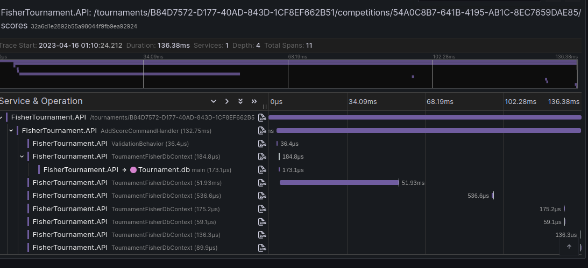
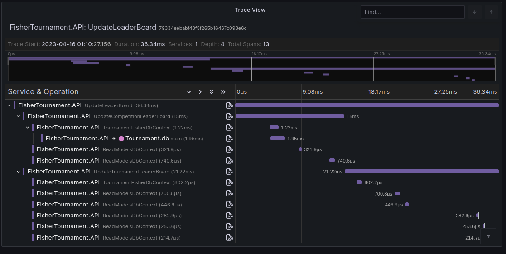
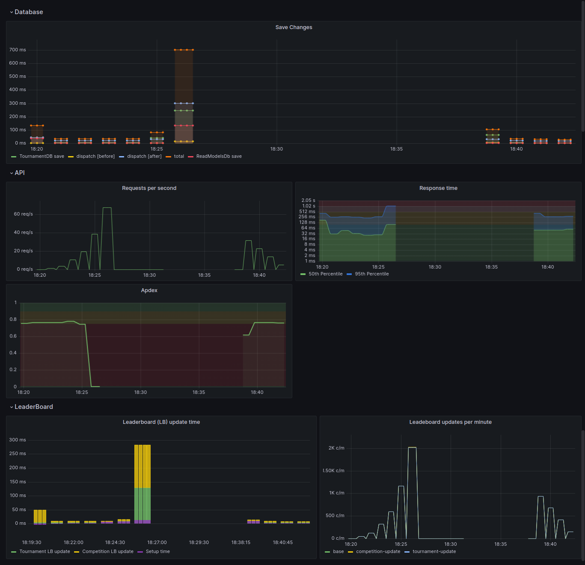
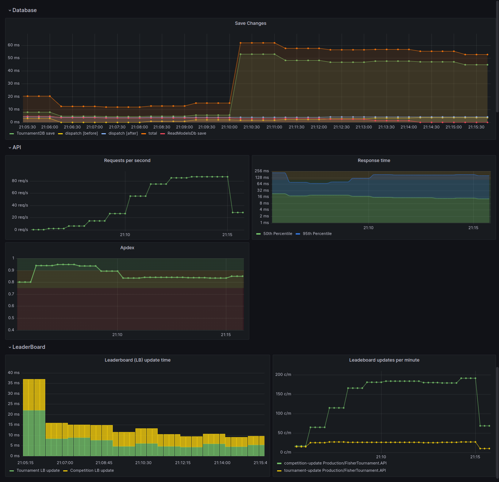

# Context
For now the tournament was updated every time a related event was fired in the domain. This introduces latency in to the user response.

```csharp
public class UpdateLeaderBoardEventsHandler
 : INotificationHandler<ScoreAddedDomainEvent>,
    INotificationHandler<ParticipationAddedDomainEvent>,
    INotificationHandler<InscriptionAddedDomainEvent>
{
    public async Task Handle(ScoreAddedDomainEvent notification,
                             CancellationToken cancellationToken)
    {
        await UpdateLeaderBoard(notification.data);
    }

    public async Task Handle(ParticipationAddedDomainEvent notification,
                             CancellationToken cancellationToken)
    {
        await UpdateLeaderBoard(notification.data);
    }

    public async Task Handle(InscriptionAddedDomainEvent notification,
                             CancellationToken cancellationToken)
    {
        await UpdateLeaderBoard(notification.data);
    }

    private async Task UpdateLeaderBoard(LeaderBoardData data)
    {
        // code of expensive operation
    }
}
```


As you can see in the image, the add score request is delayed by the time it takes to update the tournament leaderboard.

# Solution
Now it schedules the update of the tournament leaderboard through a service. This service can be implemented in different ways, but the current follows this logic:
- Each job is assigned a unique TournamentID and CategoryID.
- If attempting to add a new job, and there is a scheduled job with matching TournamentID and CategoryID, the CompetitionID of the new job will be added to the previously scheduled job.
- If the CategoryID of the new job differs from the previously scheduled job, the new job will be added independently.
- If there is no pre-existing job associated with the TournamentID, the system will check whether the tournament has been recently updated for the specified CategoryID.
- If the tournament has been updated, a new job will be created and scheduled for execution in 5 seconds.
- If there is no record of a recent update, a new job will be created and scheduled for execution as soon as possible.

> **NOTE:** 5 seconds is used as a reference time, but it can be easily changed. Anyway this is a window that is used to batch the updates.

Important:
- This logic ensures that the leaderboard is updated **as soon as possible under normal circumstances**, but also that they are processed in batches if there are multiple events fired in a short period of time.
- This also **allows the system to replace the schedule with a more complex one**, such as a distributed queue using RabbitMQ where the updater and leader board is handled by microservices and such, without affecting the rest of the system.

```csharp
public class UpdateLeaderBoardEventsHandler
 : INotificationHandler<ScoreAddedDomainEvent>,
    INotificationHandler<ParticipationAddedDomainEvent>,
    INotificationHandler<InscriptionAddedDomainEvent>
{
    private readonly ILeaderBoardUpdateService _leaderBoardUpdateService;

    public UpdateLeaderBoardEventsHandler(ILeaderBoardUpdateService leaderBoardUpdateService)
    {
        _leaderBoardUpdateService = leaderBoardUpdateService;
    }

    public async Task Handle(ScoreAddedDomainEvent notification,
                             CancellationToken cancellationToken)
    { 
        await _leaderBoardUpdateService.ScheduleUpdate(notification.data);
    }

    public async Task Handle(ParticipationAddedDomainEvent notification,
                             CancellationToken cancellationToken)
    {
        await _leaderBoardUpdateService.ScheduleUpdate(notification.data);
    }

    public async Task Handle(InscriptionAddedDomainEvent notification,
                             CancellationToken cancellationToken)
    {
        await _leaderBoardUpdateService.ScheduleUpdate(notification.data);
    }
}
```

Now the request look way cleaner:


*add score request*


*leader board update method*

# Implementation details

```csharp
    public record Job(TournamentId TournamentId,
                    CategoryId CategoryId,
                    List<CompetitionId> CompetitionsToUpdate);

    public interface ILeaderBoardUpdateScheduler
    {
        /// <summary>
        /// Updates the competition leader board then updates the tournament leader board.
        /// Only for the given category.
        /// </summary>
        /// <param name="tournamentId"></param>
        /// <param name="competitionId"></param>
        /// <param name="categoryId"></param>
        void ScheduleLeaderBoardUpdate(TournamentId tournamentId, CompetitionId competitionId, CategoryId categoryId);

        /// <summary>
        /// Updates all the competition leader boards then updates the tournament leader board.
        /// Only for the given category.
        /// </summary>
        /// <param name="tournamentId"></param>
        void ScheduleLeaderBoardUpdate(TournamentId tournamentId, CategoryId categoryId);

        /// <summary>
        /// Get the next job that is ready to be executed, removing it from the job dictionary.
        /// </summary>
        /// <returns>A Job object representing the next job to be executed, or null if there are no jobs ready.</returns>
        Job? GetNextJob();
    }

```
*Implemented at [LeaderBoardUpdateScheduler.cs](/FisherTournament.Infrastructure/LeaderBoard/LeaderBoardUpdateScheduler.cs)*

# Comparing stress test

## K6 stress test
The test consist of 10 minutes with an ramping arrival rate up to 40 concurrent users. Both test were executed with the same database checkpoint.

**Before**
```
     ✓ status 200

     checks.........................: 100.00% ✓ 13017     ✗ 0    
     data_received..................: 13 MB   21 kB/s
     data_sent......................: 6.6 MB  11 kB/s
     http_req_blocked...............: avg=33.77µs  min=1.23µs med=4.56µs  max=22.37ms p(90)=12.36µs  p(95)=22.33µs 
     http_req_connecting............: avg=19.5µs   min=0s     med=0s      max=22.14ms p(90)=0s       p(95)=0s      
     http_req_duration..............: avg=51.15ms  min=1.92ms med=19.64ms max=2.15s   p(90)=139.88ms p(95)=213.6ms 
       { expected_response:true }...: avg=51.15ms  min=1.92ms med=19.64ms max=2.15s   p(90)=139.88ms p(95)=213.6ms 
     http_req_failed................: 0.00%   ✓ 0         ✗ 26037
     http_req_receiving.............: avg=126.65µs min=9.72µs med=55.82µs max=46.57ms p(90)=158.44µs p(95)=230.22µs
     http_req_sending...............: avg=36.01µs  min=5.05µs med=19.44µs max=10.48ms p(90)=65.95µs  p(95)=82.74µs 
     http_req_tls_handshaking.......: avg=0s       min=0s     med=0s      max=0s      p(90)=0s       p(95)=0s      
     http_req_waiting...............: avg=50.99ms  min=1.85ms med=19.42ms max=2.15s   p(90)=139.76ms p(95)=213.47ms
     http_reqs......................: 26037   43.069922/s
     iteration_duration.............: avg=89.93ms  min=8.21ms med=60.78ms max=2.15s   p(90)=210.15ms p(95)=275.8ms 
     iterations.....................: 13017   21.53248/s
     vus............................: 500     min=500     max=500
     vus_max........................: 500     min=500     max=500


running (10m04.5s), 000/500 VUs, 13017 complete and 3 interrupted iterations
stress ✗ [================>---------------------] 003/500 VUs  10m04.5s/22m20s  40.00 iters/s
ERRO[0605] test run was aborted because k6 received a 'interrupt' signal 
```

**After**
```
     ✓ status 200

     checks.........................: 100.00% ✓ 12942     ✗ 0    
     data_received..................: 13 MB   21 kB/s
     data_sent......................: 6.5 MB  11 kB/s
     http_req_blocked...............: avg=36.89µs  min=1.2µs  med=4.68µs  max=20.97ms p(90)=12.54µs  p(95)=22.82µs 
     http_req_connecting............: avg=21.89µs  min=0s     med=0s      max=20.76ms p(90)=0s       p(95)=0s      
     http_req_duration..............: avg=39.39ms  min=1.98ms med=18.79ms max=1.12s   p(90)=95.04ms  p(95)=147.67ms
       { expected_response:true }...: avg=39.39ms  min=1.98ms med=18.79ms max=1.12s   p(90)=95.04ms  p(95)=147.67ms
     http_req_failed................: 0.00%   ✓ 0         ✗ 25886
     http_req_receiving.............: avg=116.23µs min=9.5µs  med=55µs    max=43.87ms p(90)=157.37µs p(95)=211.55µs
     http_req_sending...............: avg=37.01µs  min=5.13µs med=19.97µs max=8.99ms  p(90)=66.72µs  p(95)=84.55µs 
     http_req_tls_handshaking.......: avg=0s       min=0s     med=0s      max=0s      p(90)=0s       p(95)=0s      
     http_req_waiting...............: avg=39.24ms  min=1.9ms  med=18.59ms max=1.12s   p(90)=94.92ms  p(95)=147.62ms
     http_reqs......................: 25886   42.955237/s
     iteration_duration.............: avg=65.08ms  min=5.53ms med=48.03ms max=1.12s   p(90)=144.18ms p(95)=193.62ms
     iterations.....................: 12942   21.475959/s
     vus............................: 500     min=500     max=500
     vus_max........................: 500     min=500     max=500


running (10m02.6s), 000/500 VUs, 12942 complete and 2 interrupted iterations
stress ✗ [================>---------------------] 002/500 VUs  10m02.6s/22m20s  40.00 iters/s
ERRO[0604] test run was aborted because k6 received a 'interrupt' signal 
```

The average response time after the update was 70% better.

**Before**


**After**


As you can see, in the not optimized version, the server has to process more than 2000 per minute of leader board updates. In the optimized version, the server only has to process up to 200 per minute of leader board updates. Also, notice how it optimizes the tournament leader board update when it collected multiple competitions in the same tournament.

> NOTE: In reality the tournament cannot have multiple competitions active at the same time, but this is just an demo.

I think at this point a microservice for the leaderboard would be a good idea to reduce the complexity of the core module.

**Conclusion**
- x10 less leader board updates per minute
- managed to maintain leaderboard consistency withing a reasonable time frame
- Apdex score increased
- now the server can handle more concurrent users (new limit to test)